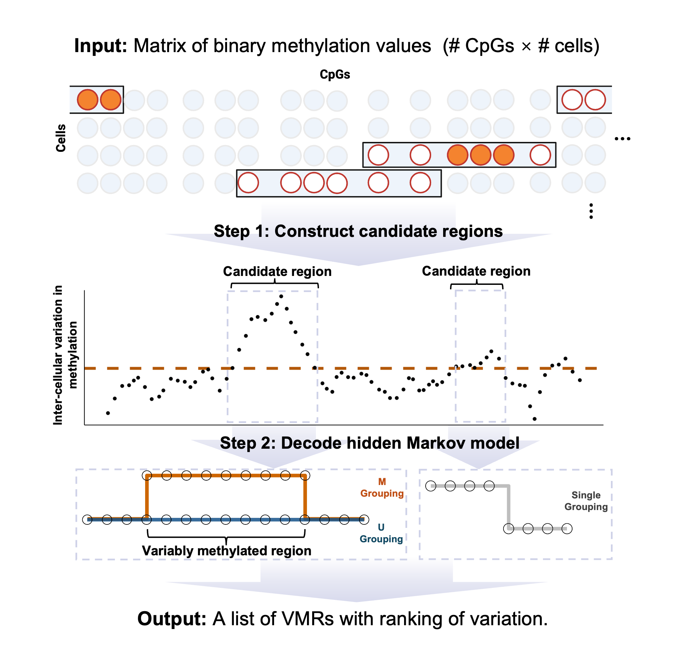

# vmrseq: Detecting variably methylated regions (VMRs) from single-cell bisulfite sequencing

The R package `vmrseq` is a novel computational tool developed for pinpointing variably methylated regions (VMRs) in scBS-seq data without prior knowledge on size or location. High-throughput single-cell measurements of DNA methylation allows studying inter-cellular epigenetic heterogeneity, but this task faces the challenges of sparsity and noise. vmrseq overcomes these challenges and identifies variably methylated regions accurately and robustly. 




## Installation

You can install the development version of `vmrseq` from
[GitHub](https://github.com/) with:

``` r
# install.packages("devtools")
devtools::install_github("nshen7/vmrseq")
```

## Online Vignette

An online vignette of how to use the vmrseq package can be found at 
[https://rpubs.com/nshen7/vmrseq-vignette](https://rpubs.com/nshen7/vmrseq-vignette)


## Citation

Shen, Ning, and Keegan Korthauer. 2023. “Vmrseq: Probabilistic Modeling of Single-Cell Methylation Heterogeneity.” bioRxiv. [https://doi.org/10.1101/2023.11.20.567911](https://doi.org/10.1101/2023.11.20.567911).

## License/Copyright

[](https://opensource.org/licenses/MIT) 
This package is made available under an MIT license.  
